# 认知感知模块技术文档

## 📋 目录

1. [模块概述](#模块概述)
2. [核心设计原则](#核心设计原则)
3. [系统架构](#系统架构)
4. [核心类详解](#核心类详解)
5. [噪声模型详解](#噪声模型详解)
6. [卡尔曼滤波系统](#卡尔曼滤波系统)
7. [可视化功能](#可视化功能)
8. [集成与使用](#集成与使用)
9. [配置参数详解](#配置参数详解)
10. [最佳实践](#最佳实践)

---

## 📖 模块概述

**认知感知模块** (`cognitive_perception_module.py`) 是一个高级的传感器噪声模拟系统，专门设计用于在MetaDrive自动驾驶仿真环境中注入真实的传感器噪声。该模块在**雷达传感器的原始测量层面**注入噪声，确保噪声影响的是传感器输出而非环境的物理状态。

### 🎯 核心功能

- **真实传感器噪声模拟**：模拟高斯测距噪声、漏检、误检、角度抖动等真实雷达传感器特性
- **智能滤波系统**：集成卡尔曼滤波器（CV模型）、AR(1)模型、低通滤波等多种滤波技术
- **非侵入式设计**：不修改环境物理状态，仅在传感器输出层注入噪声
- **可视化分析**：提供噪声效果对比图、卡尔曼滤波性能时序图等分析工具
- **灵活配置**：支持丰富的参数配置，适应不同研究需求

---

## 🎯 核心设计原则

模块严格遵循以下核心原则，确保仿真的真实性和可靠性：

### A. 物理状态保护原则
- **绝不修改环境真实状态**：不调用任何`agent.set_position()`等会影响车辆动力学、碰撞检测或奖励计算的接口
- **保持物理一致性**：环境的物理模拟保持完全真实，噪声仅存在于感知层面

### B. 精确噪声注入位置
- **传感器层注入**：在雷达传感器类（`Lidar`）输出原始距离数组（米）**之后**、被`ObservationManager`归一化**之前**注入噪声
- **米制域处理**：所有噪声计算和滤波处理都在"米"单位的原始距离上进行

### C. 观测结构不变原则
- **保持接口一致性**：无论环境使用扁平1D观测还是字典观测，结构保持不变
- **上游噪声传播**：噪声在传感器层注入后，自然传播到最终的观测向量中

### D. 时间相关性处理
- **滤波器状态管理**：卡尔曼滤波、AR(1)等时间相关滤波在米制原始距离上进行
- **状态重置机制**：提供`reset()`方法清空所有滤波器状态

---

## 🏗️ 系统架构

```mermaid
graph TB
    A[物理世界] --> B[雷达射线检测]
    B --> C[原始距离测量<br/>单位：米]
    C --> D[🎯 噪声注入层<br/>PerceptNoiseLidar]
    D --> E[归一化处理<br/>ObservationManager]
    E --> F[最终观测向量<br/>Agent输入]
    
    G[CognitivePerceptionModule] --> D
    H[噪声配置] --> G
    I[卡尔曼滤波器] --> D
    J[AR1/低通滤波] --> D
    
    D --> K[可视化系统]
    K --> L[噪声对比图]
    K --> M[KF时序图]
```



### 数据流说明

1. **物理世界** → **雷达射线检测**：MetaDrive物理引擎进行真实的射线投射检测
2. **原始距离测量**：获得每个雷达束的真实距离值（米）
3. **🎯 噪声注入层**：`PerceptNoiseLidar`在此层注入各种噪声模型
4. **归一化处理**：MetaDrive的`ObservationManager`将距离归一化到[0,1]
5. **最终观测向量**：包含噪声影响的观测数据传递给智能体

---

## 🔧 核心类详解

### 1. PerceptNoiseLidar 类

**继承关系**：`PerceptNoiseLidar` → `Lidar` → `DistanceDetector` → `BaseSensor`

```python
class PerceptNoiseLidar(Lidar):
    """
    带噪声的雷达传感器，继承MetaDrive的Lidar类
    在原始距离测量（米）上注入各种噪声模型
    """
```

#### 🔑 关键方法

##### `perceive()` - 核心噪声注入方法
```python
def perceive(self, physics_world, num_lasers, detector_mask, mask, extra_filter_node, render)
```
- **功能**：重写父类的感知方法，在获得原始距离后注入噪声
- **噪声注入位置**：在`super().perceive()`获得原始距离后，返回给MetaDrive之前
- **处理流程**：原始距离 → 噪声注入 → 滤波处理 → 返回带噪声的距离

##### `_apply_noise_models()` - 多重噪声模型
```python
def _apply_noise_models(self, distances: np.ndarray, max_range: float) -> np.ndarray
```
- **高斯测距噪声**：`sigma(d) = sigma0 + k * d`（距离越远噪声越大）
- **漏检模拟**：以概率`p_miss(d)`将检测结果置为最大距离
- **误检模拟**：以概率`p_false`生成虚假的近距离检测
- **角度抖动**：模拟传感器安装误差导致的角度偏移

##### `_kf_filter()` - 卡尔曼滤波系统
```python
def _kf_filter(self, z_distances: np.ndarray, sigma_array: np.ndarray, return_var: bool = False)
```
- **模型类型**：1D 常速（CV）模型，每个雷达束独立滤波
- **状态向量**：`[位置, 速度]` 对应 `[距离, 距离变化率]`
- **输出选项**：可选择返回位置方差，用于不确定性可视化

#### 🎛️ 状态管理

```python
# 每个雷达束独立的状态变量
self.ar1_states = None      # AR(1)噪声状态
self.prev_distances = None  # 上次滤波距离
self.kf_state = None        # KF状态向量 (N, 2)
self.kf_P = None           # KF协方差矩阵 (N, 2, 2)
```

### 2. CognitivePerceptionModule 类

**主接口类**，负责将噪声雷达集成到MetaDrive环境中。

```python
class CognitivePerceptionModule:
    """
    认知感知模块 - 主接口类
    负责将噪声雷达集成到MetaDrive环境中
    """
```

#### 🔑 关键方法

##### `attach_to_env()` - 传感器替换
```python
def attach_to_env(self, env)
```
- **功能**：将噪声雷达替换环境中的原始雷达传感器
- **实现机制**：修改`env.engine.sensors["lidar"]`指向噪声雷达实例
- **安全性**：保存原始雷达引用，支持恢复

##### `detach_from_env()` - 传感器恢复
```python
def detach_from_env(self)
```
- **功能**：恢复原始雷达传感器，清理噪声雷达
- **应用场景**：环境关闭时调用，确保不影响后续使用

##### `generate_visualization()` - 可视化生成
```python
def generate_visualization(self, env=None, test_distances=None, max_range=50.0)
```
- **数据来源**：使用运行时的`PerceptNoiseLidar`实例，确保配置一致性
- **图表类型**：噪声对比图、卡尔曼滤波时序图
- **输出路径**：自动保存到环境的可视化目录下的`cog_influence`文件夹

---

## 🎲 噪声模型详解

### 1. 高斯测距噪声

**数学模型**：
```
σ(d) = σ₀ + k × d
noise ~ N(0, σ(d)²)
```

**物理意义**：
- **σ₀**：传感器固有噪声（与距离无关）
- **k**：距离相关系数，反映远距离测量的不确定性增加
- **典型值**：σ₀ = 0.1米，k = 0.02

**代码实现**：
```python
sigma_array = self.sigma0 + self.k * distances
gaussian_noise = np.random.normal(0, sigma_array)
```

### 2. 漏检模型

**数学模型**：
```
p_miss(d) = p_miss₀ × (1 + d/d_far)
```

**物理意义**：
- 模拟雷达在远距离或恶劣条件下无法检测到目标的情况
- 漏检时将该束距离设为最大检测距离（表示"未检测到"）

**代码实现**：
```python
p_miss = self.p_miss0 * (1 + distances / self.far_distance)
miss_mask = np.random.random(len(distances)) < p_miss
noisy_distances[miss_mask] = max_range
```

### 3. 误检模型

**数学模型**：
```
p_false = 常数
假距离 ~ U(d_near_min, d_near_max)
```

**物理意义**：
- 模拟传感器检测到实际不存在的"幻影"目标
- 通常发生在近距离范围，由多径反射等因素造成

**代码实现**：
```python
false_mask = np.random.random(len(distances)) < self.p_false
false_distances = np.random.uniform(self.near_min, self.near_max, size=np.sum(false_mask))
noisy_distances[false_mask] = false_distances
```

### 4. 角度抖动

**数学模型**：
```
jitter ~ U(-jitter_steps, +jitter_steps)
distances_new = roll(distances, jitter)
```

**物理意义**：
- 模拟传感器安装误差或振动导致的整体角度偏移
- 影响所有雷达束的角度对应关系

### 5. 时间相关性模型

#### AR(1) 自回归模型
```
n_t = ρ × n_{t-1} + √(1-ρ²) × ξ_t
```
- **ρ**：自相关系数 (0 < ρ < 1)
- **ξ_t**：白噪声
- **特点**：保持噪声的时间连续性，避免突然跳跃

#### 低通滤波器
```
d_filt_t = α × d_noisy_t + (1-α) × d_filt_{t-1}
```
- **α**：滤波系数 (0 < α < 1)
- **特点**：平滑距离变化，减少高频噪声

---

## 🔍 卡尔曼滤波系统

### 滤波器模型

**状态向量**：
```
x = [r, ṙ]ᵀ    # [距离, 距离变化率]
```

**状态转移矩阵**：
```
F = [1  Δt]
    [0   1]
```

**观测矩阵**：
```
H = [1  0]
```

**过程噪声协方差**：
```
Q = q × [Δt⁴/4  Δt³/2]
        [Δt³/2   Δt²  ]
```

### 滤波流程

1. **预测步骤**：
   ```python
   x_pred = F @ x
   P_pred = F @ P @ F.T + Q
   ```

2. **更新步骤**：
   ```python
   y = z - H @ x_pred           # 观测残差
   S = H @ P_pred @ H.T + R     # 残差协方差
   K = P_pred @ H.T @ inv(S)    # 卡尔曼增益
   x_new = x_pred + K @ y       # 状态更新
   P_new = (I - K @ H) @ P_pred # 协方差更新
   ```

### 自适应特性

- **动态观测噪声**：根据距离自适应调整观测噪声 `R = σ(d)²`
- **数值稳定性**：使用Joseph形式更新协方差矩阵，添加下限防止数值问题
- **独立滤波**：每个雷达束使用独立的卡尔曼滤波器

---

## 📊 可视化功能

### 1. 噪声效果对比图

**图表类型**：`plot_noise_comparison()`

**内容包括**：
- **子图1**：雷达束索引 vs 距离曲线（真实距离 vs 加噪距离）
- **子图2**：噪声分布直方图 + 高斯拟合曲线

**示例输出**：
```
📊 噪声统计：
- 平均噪声：-0.045米
- 噪声标准差：1.234米  
- 噪声范围：[-3.2, +4.1]米
```

### 2. 卡尔曼滤波时序图

**图表类型**：`plot_kf_timeseries()`

**内容包括**：
- **真值曲线**：地面真实距离（绿色实线）
- **测量曲线**：带噪声的测量值（红色散点）
- **估计曲线**：卡尔曼滤波估计（蓝色实线）
- **不确定性带**：±1σ 置信区间（蓝色填充）

**性能指标**：
```
📈 滤波性能：
- 测量RMSE：2.957米
- 滤波RMSE：2.934米
- 改善率：0.78%
```

### 3. 可视化集成

**自动化生成**：
- 环境关闭时自动调用`generate_visualization()`
- 图片保存到`visualization_output_dir/cog_influence/`目录
- 文件名包含时间戳，避免覆盖

**配置一致性**：
- 使用运行时实际的`PerceptNoiseLidar`实例
- 确保可视化参数与仿真参数完全一致

---

## 🔧 集成与使用

### 1. 基本使用流程

```python
# 1. 创建认知感知模块
perception_module = CognitivePerceptionModule(noise_config)

# 2. 在环境reset后附加噪声雷达
env.reset()
perception_module.attach_to_env(env)

# 3. 正常运行环境（噪声自动生效）
for step in range(1000):
    obs, reward, done, info = env.step(action)
    if done:
        break

# 4. 环境关闭时分离噪声雷达
perception_module.detach_from_env()
env.close()
```

### 2. 与TrajectoryReplayEnvCognitive集成

```python
# 在trajectory_replay_cognitive.py中的集成示例
def reset(self):
    obs = super().reset()
    
    # 附加认知感知模块
    if self.enable_cognitive_modules and self.perception_module:
        self.perception_module.attach_to_env(self)
    
    return obs

def close(self):
    # 生成可视化（在detach之前）
    if self.perception_module:
        self.perception_module.generate_visualization(env=self)
        self.perception_module.detach_from_env()
    
    super().close()
```

### 3. 工厂函数使用

```python
# 便捷创建方法
from cognitive_perception_module import create_cognitive_perception_module

# 使用默认配置
module = create_cognitive_perception_module()

# 使用自定义配置
custom_config = {
    'sigma0': 0.2,
    'k': 0.01,
    'p_false': 0.0001,
    'use_kf': True
}
module = create_cognitive_perception_module(custom_config)
```

---

## ⚙️ 配置参数详解

### 基础噪声参数

| 参数 | 默认值 | 单位 | 说明 |
|------|--------|------|------|
| `sigma0` | 0.1 | 米 | 基础高斯噪声标准差 |
| `k` | 0.02 | - | 距离相关噪声系数 |
| `p_miss0` | 0.01 | - | 基础漏检概率 |
| `far_distance` | 50.0 | 米 | 漏检概率计算的远距离参考 |
| `p_false` | 0.0001 | - | 误检概率（保守值） |
| `near_min` | 1.0 | 米 | 误检距离最小值 |
| `near_max` | 5.0 | 米 | 误检距离最大值 |
| `angle_jitter_steps` | 1 | 束 | 角度抖动的束数 |

### 时间相关性参数

| 参数 | 默认值 | 说明 |
|------|--------|------|
| `use_ar1` | True | 启用AR(1)模型 |
| `rho` | 0.8 | AR(1)自相关系数 |
| `use_lowpass` | False | 启用低通滤波 |
| `alpha` | 0.7 | 低通滤波系数 |

### 卡尔曼滤波参数

| 参数 | 默认值 | 单位 | 说明 |
|------|--------|------|------|
| `use_kf` | True | - | 启用卡尔曼滤波 |
| `kf_dt` | 0.1 | 秒 | 滤波器时间步长 |
| `kf_q` | 0.5 | - | 过程噪声谱密度 |
| `kf_sigma_a` | 3.0 | 米/秒² | 加速度噪声标准差 |
| `kf_q_scale` | 100.0 | - | 过程噪声缩放因子 |
| `kf_r_floor` | 1e-4 | 米² | 观测噪声方差下限 |
| `kf_init_std_pos` | 5.0 | 米 | 初始位置不确定性 |
| `kf_init_std_vel` | 10.0 | 米/秒 | 初始速度不确定性 |

### 配置优化建议

#### 保守配置（适合初始测试）
```python
conservative_config = {
    'sigma0': 0.05,     # 较小的基础噪声
    'k': 0.01,          # 较小的距离系数
    'p_false': 0.0001,  # 很低的误检率
    'p_miss0': 0.005,   # 较低的漏检率
    'use_kf': True,     # 启用滤波
    'kf_q': 0.1         # 较强的滤波
}
```

#### 激进配置（适合鲁棒性测试）
```python
aggressive_config = {
    'sigma0': 0.3,      # 较大的基础噪声
    'k': 0.05,          # 较大的距离系数
    'p_false': 0.001,   # 中等误检率
    'p_miss0': 0.02,    # 中等漏检率
    'use_kf': True,     # 启用滤波
    'kf_q': 1.0         # 较弱的滤波
}
```

---

## 💡 最佳实践

### 1. 参数调优策略

**渐进式调优**：
1. 从保守配置开始
2. 逐步增加噪声强度
3. 观察可视化结果调整参数
4. 验证智能体性能影响

**关键指标监控**：
- 噪声分布的合理性（均值接近0）
- 卡尔曼滤波的收敛性
- 智能体决策的稳定性

### 2. 调试技巧

**可视化验证**：
```python
# 生成可视化图表进行参数验证
module.generate_visualization(env, test_distances, max_range=50.0)
```

**日志监控**：
```python
import logging
logging.basicConfig(level=logging.INFO)
# 观察模块初始化和运行日志
```

**性能分析**：
```python
# 对比开启/关闭噪声的智能体性能
no_noise_rewards = evaluate_agent(env_clean)
with_noise_rewards = evaluate_agent(env_noisy)
```

### 3. 常见问题解决

**问题1：噪声过大导致智能体性能严重下降**
- **解决**：减小`sigma0`和`k`参数，启用卡尔曼滤波

**问题2：误检率过高影响导航**
- **解决**：降低`p_false`参数（建议<0.001）

**问题3：卡尔曼滤波不收敛**
- **解决**：调整`kf_q`参数，增加`kf_r_floor`防止数值问题

**问题4：可视化图片未生成**
- **解决**：确保环境正确调用`generate_visualization()`，检查权限

### 4. 性能优化

**内存优化**：
- 合理设置雷达束数，避免过多状态变量
- 及时调用`reset()`清理滤波器状态

**计算优化**：
- 卡尔曼滤波使用向量化计算
- 避免在每步都进行复杂的噪声计算

**可扩展性**：
- 模块化设计支持添加新的噪声模型
- 配置驱动的参数管理便于不同场景切换

---

## 🔬 技术特色

### 1. 非侵入式设计
- **零影响原则**：不修改MetaDrive的核心代码
- **插件式集成**：通过传感器替换实现噪声注入
- **可逆操作**：支持完全恢复到原始状态

### 2. 科学严谨的噪声建模
- **物理基础**：基于真实传感器特性建模
- **数学严格**：所有噪声模型都有明确的数学表达
- **统计有效**：噪声分布符合实际传感器统计特性

### 3. 先进的滤波技术
- **多模型支持**：卡尔曼滤波、AR(1)、低通滤波
- **自适应特性**：根据距离动态调整噪声参数
- **数值稳定**：考虑数值精度和稳定性问题

### 4. 完善的分析工具
- **实时可视化**：运行时生成分析图表
- **定量评估**：提供详细的统计指标
- **调试友好**：丰富的日志和错误处理

---

## 📚 参考文献

1. **传感器噪声建模**：
   - "Probabilistic Robotics" by Thrun, Burgard, and Fox
   - "Radar Signal Processing" by Richards et al.

2. **卡尔曼滤波理论**：
   - "Optimal State Estimation" by Dan Simon
   - "Introduction to Random Signals and Applied Kalman Filtering" by Brown & Hwang

3. **MetaDrive文档**：
   - [MetaDrive Official Documentation](https://metadrive-simulator.readthedocs.io/)
   - [MetaDrive GitHub Repository](https://github.com/metadriverse/metadrive)

---

## 📞 技术支持

如需技术支持或报告问题，请参考：

1. **模块日志**：查看详细的运行日志信息
2. **可视化输出**：分析生成的图表文件
3. **配置验证**：确认参数设置的合理性
4. **性能监控**：对比噪声前后的系统性能

---

*本文档版本：v1.0 | 最后更新：2025-01-15* 